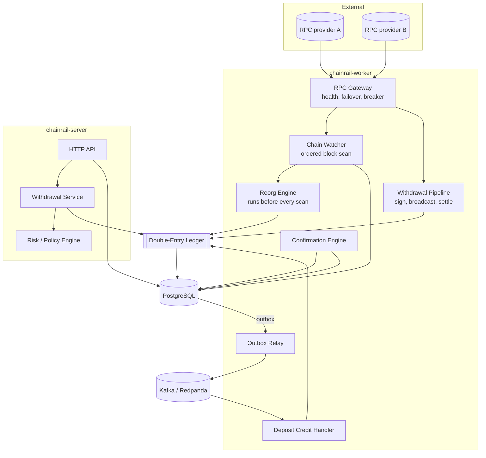
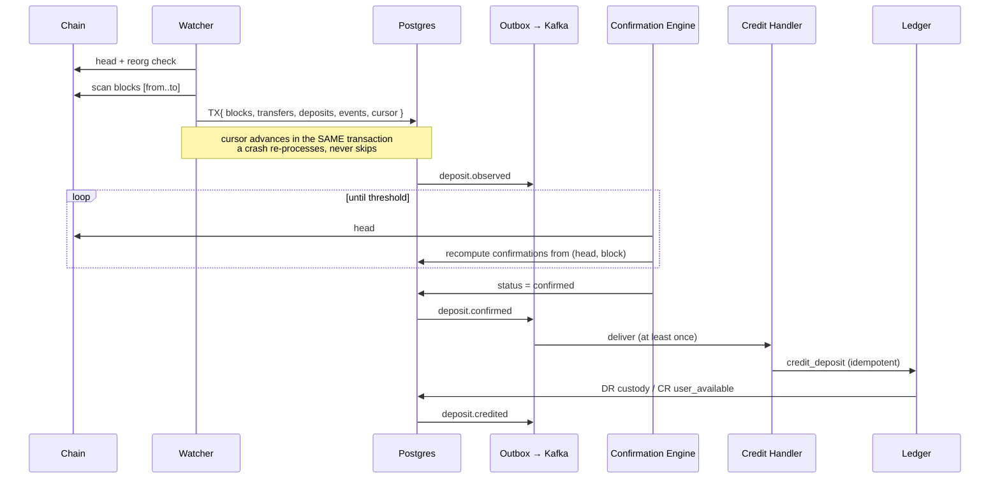
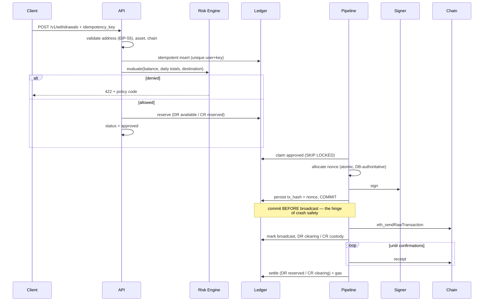

# Architecture

## Shape

ChainRail is a **modular monolith**: one workspace, twelve library crates, two
binaries. The crate boundaries are where service boundaries would go, so any
component can be extracted later without redesigning it — but nothing pays the
cost of a network hop it does not need yet.

## Crates

| Crate | Responsibility | Depends on I/O? |
|---|---|---|
| `common` | Money, chain identity, config, errors, event envelope | No |
| `database` | Pool, migrations, row types, repositories (SQL only) | Postgres |
| `rpc` | JSON-RPC gateway: health scoring, failover, circuit breaker | HTTP |
| `chains-evm` | ABI codec, typed client, `ChainAdapter` implementation | via `rpc` |
| `signer` | `Signer` trait + development backends | No |
| `ledger` | Postings, balances, statements, integrity verification | Postgres |
| `events` | Kafka bus, outbox relay, consumer runtime, dedupe | Kafka, Postgres |
| `risk` | Policy evaluation (pure function) | No |
| `deposits` | Watcher, deposit engine, confirmations, reorg recovery | Postgres, chain |
| `withdrawals` | Request service, state machine, pipeline | Postgres, chain |
| `observability` | Logging, metrics, tracing | — |
| `api` | Axum router, DTOs, middleware, error mapping | — |

`common`, `risk`, and the pure halves of `rpc` (`health.rs`), `chains-evm`
(`abi.rs`), `deposits` (`find_common_ancestor`, `next_range`) and `ledger`
(`posting.rs`) have **no I/O at all**. That is deliberate: the decisions most
likely to be wrong — confirmation arithmetic, ancestor search, circuit-breaker
transitions, policy ordering, balance validation — are testable without a
database, a broker, or a chain.

## Deposit lifecycle

States: `observed → confirming → confirmed → credited`, with `reorged` and
`failed` as terminal escapes.

Confirmation is **recomputed** from `(head, including_block)` on every pass, never
incremented. A restart, a duplicate pass or a rewound head all converge on the
same answer.

Crediting is a separate consumer from confirmation so that "is this final?" and
"move the money" are independently retryable — and so the credit path can be
paused during an incident without stopping chain indexing.

## Withdrawal lifecycle

States: `requested → validated → approved → signing → broadcast → confirming →
completed`, with `failed` reachable throughout and `cancelled` reachable only
before broadcast.

The state machine is defined **twice**: in Rust (`WithdrawalStatus::can_transition_to`)
and as a Postgres trigger. `the_rust_state_machine_matches_the_database_trigger`
checks all 72 ordered pairs agree, so the two cannot drift.

## Ordering guarantee, and why commit-before-broadcast

Broadcasting is an irreversible effect on a system we do not control. The only
safe ordering is:

1. Allocate the nonce, sign, **persist the hash, commit**.
2. Broadcast.
3. Record the broadcast, commit.

Signing is deterministic (RFC-6979), so the hash is known before the transaction
leaves the process. A crash between (1) and (3) leaves a withdrawal in `signing`
with a durable hash, and recovery becomes a *lookup* rather than a guess: ask the
chain whether that hash exists. If it does, move forward. If it does not, re-sign
with the **recorded** nonce — producing byte-identical output — and re-broadcast.

The reverse ordering would lose the hash on a crash and strand funds with no way
to reconcile them. Both branches are tested
(`a_crash_after_broadcast_is_reconciled_from_the_chain_not_re_sent`,
`a_broadcast_that_never_landed_is_re_sent_as_the_same_transaction`).

## Reorg handling

The watcher reconciles lineage **before** scanning anything new, so a fork is
never built on top of.

Detection: ChainRail stores `(height, hash, parent_hash)` for every block it
processes. If the chain's block at the cursor height has a different hash than
stored, walk backwards until stored and chain hashes agree — that height is the
common ancestor.

Recovery, in one transaction:

1. Orphan every canonical block above the ancestor. The partial unique index
   `(chain, height) WHERE status='canonical'` makes this *mandatory* before a
   replacement can be inserted — the schema prevents forgetting.
2. Mark transfers from those blocks orphaned.
3. Transition their deposits to `reorged`.
4. For an already-credited deposit, post a compensating ledger transaction.
5. Rewind the cursor to the ancestor so replacements are re-scanned. Safe because
   transfer insertion is idempotent on `(chain, tx_hash, log_index)`.

A reorg deeper than `reorg_scan_depth` is **escalated, not guessed** — a wrong
rewind point could double-reverse or re-credit. Config validation requires
`reorg_scan_depth > required_confirmations`, so any reorg able to invalidate a
credited deposit is at least always detectable.

## Idempotency inventory

| Operation | Mechanism |
|---|---|
| Transfer observation | `UNIQUE (chain, tx_hash, log_index)` |
| Deposit creation | `UNIQUE (blockchain_transaction_id)` |
| Deposit credit | `processed_events` + status CAS + ledger key + the two above |
| Withdrawal creation | `UNIQUE (user_id, idempotency_key)` + body fingerprint |
| Withdrawal broadcast | Deterministic signing + DB-authoritative nonce |
| Ledger posting | `UNIQUE (idempotency_key)` |
| Event publication | `UNIQUE (outbox.event_id)` + deterministic event ids |
| Event consumption | `PRIMARY KEY (consumer, event_id)` |
| User creation | `UNIQUE (external_id)` |
| Address assignment | `UNIQUE (user_id, chain)` + pool claim |

Deposit crediting has four independent defences. Any one would suffice; having
all four means a bug in one layer cannot mint money.

## Scaling

**Both binaries scale horizontally with no coordination service.** Queue claims
use `FOR UPDATE SKIP LOCKED`, Kafka consumer groups partition events, and every
side effect is idempotent — so replicas partition work between themselves
automatically.

Two caveats:

- Running two watchers for the *same* chain is safe but wasteful: both scan the
  same ranges and one loses every insert to the unique constraint. Partition by
  chain instead (`worker.run_watcher` plus a per-chain config).
- Kafka partition key is the user id, giving per-user ordering. Global event
  ordering is not provided and is not needed.

## Non-EVM chains

`ChainAdapter` is the seam. A Solana implementation would need:

- **Slots, not blocks.** Slots can be skipped; lineage is by parent slot, and
  `find_common_ancestor` would work on slots instead of heights.
- **Deterministic finality.** `FinalityPolicy::Tag { tag: "finalized" }` already
  exists for this; `is_confirmed` deliberately returns `false` for tag policies
  so the adapter must answer via a dedicated query rather than by arithmetic.
- **Different transfer detection.** SPL token transfers are instructions in
  transaction metadata, not logs. `getSignaturesForAddress` plus per-transaction
  parsing replaces `eth_getLogs`.
- **Different signing.** Ed25519 over a recent blockhash, which expires — so the
  "sign once, retry forever" property of EVM nonces does not hold, and the
  pipeline's recovery logic would need a Solana-specific branch.

That last point is the real work, and it is why v0.1 ships EVM properly instead
of two chains partially. `AppConfig::validate` **refuses to boot** with a Solana
chain configured rather than silently ignoring it.

## Deliberate simplifications

| Simplification | Consequence | When to fix |
|---|---|---|
| Native (non-ERC-20) deposits not detected | Only token deposits are credited | When a chain's native asset needs deposit support; requires full-block scans or trace APIs |
| Deposit addresses come from a pool | An operator must top it up | It is the correct design with real custody; automate the export |
| Single global API rate limit | Crude; one client can consume the budget | Rate-limit per key at the edge |
| Bearer-token auth | No per-user identity or scopes | Before any real user traffic |
| Redis configured but unused | One less moving part | When cross-process locks or read caching are actually needed |
| Ledger integrity scans everything | O(entries) per pass | Materialise snapshots past ~10M entries |
