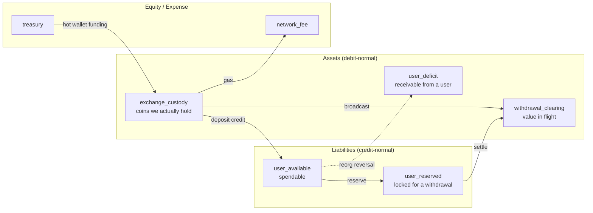

# The Ledger

ChainRail's ledger is the single source of financial truth. Every balance the API
reports is derived from it, and nothing else in the system may move money.

## Convention

Every account has a `normal_balance` of `debit` or `credit`:

| Class | Normal balance | Accounts |
|---|---|---|
| Asset | debit | `exchange_custody`, `withdrawal_clearing`, `user_deficit` |
| Liability | credit | `user_available`, `user_reserved` |
| Equity | credit | `treasury` |
| Expense | debit | `network_fee` |

`ledger_accounts.balance` is stored in the account's **natural sign**: it
increases when an entry's direction matches the account's normal balance. A
user's liability account therefore reads *positive* when they have funds, which
is what the API surfaces — no sign-flipping in the presentation layer.

Entry amounts are always **strictly positive**; `direction` carries the sign.
Storing signed amounts would make `sum(debits) == sum(credits)` unverifiable.

## The accounts



## Every posting

This is the complete set. Nothing else writes to the ledger.

| Operation | Debit | Credit |
|---|---|---|
| Deposit credit | `exchange_custody` | `user_available` |
| Deposit reversal (reorg) | `user_available` (+ `user_deficit` for any shortfall) | `exchange_custody` |
| Withdrawal reserve | `user_available` | `user_reserved` |
| Withdrawal release (cancel / pre-broadcast failure) | `user_reserved` | `user_available` |
| Withdrawal broadcast | `withdrawal_clearing` | `exchange_custody` |
| Withdrawal settle | `user_reserved` | `withdrawal_clearing` |
| Broadcast reversal (on-chain revert) | `exchange_custody` | `withdrawal_clearing` |
| Network fee | `network_fee` | `exchange_custody` |
| Custody funding | `exchange_custody` | `treasury` |

### Worked example: 100 USDC in, 25 out

```
1. Deposit credited
   DR exchange_custody       100     -> custody 100, available 100
   CR user_available         100

2. Withdrawal of 25 reserved
   DR user_available          25     -> available 75, reserved 25
   CR user_reserved           25

3. Broadcast
   DR withdrawal_clearing     25     -> custody 75, clearing 25
   CR exchange_custody        25

4. Confirmed, settled
   DR user_reserved           25     -> reserved 0, clearing 0
   CR withdrawal_clearing     25

Final: available 75, reserved 0, custody 75, clearing 0.
Liabilities (75) == custody (75). Value conserved.
```

Between steps 3 and 4 the value sits in `withdrawal_clearing` — no longer in
custody, not yet extinguished from the user's reservation. That is why solvency
is `custody + clearing − liabilities`: without the clearing leg every in-flight
withdrawal would look like a shortfall.

## Invariants, and where each is enforced

| Invariant | Enforced by |
|---|---|
| `sum(debits) == sum(credits)` per transaction | Deferred constraint trigger `ledger_entries_balanced` |
| At least 2 entries per transaction | Same trigger |
| Entry amounts strictly positive | `CHECK (amount > 0)` |
| Entry asset matches account asset | `ledger_apply_entry()` trigger |
| Cached balance never drifts from entries | `ledger_apply_entry()` owns every balance mutation |
| Spendable balance never negative | `CHECK (allow_negative OR balance >= 0)` |
| Custody never negative | Same CHECK; custody has `allow_negative = false` |
| History is immutable | `ledger_reject_mutation()` blocks UPDATE and DELETE |
| A posting happens at most once | `UNIQUE (idempotency_key)` |

All of these are **database** guarantees, not application conventions. Rust
validates the same things first so errors are precise, but the schema is what
makes them true regardless of which process writes.

Verify at any time:

```bash
curl -s localhost:8088/internal/ledger-integrity | jq
```

It compares each account's cached balance against `SUM(entries)`, looks for any
unbalanced transaction, checks for illegal negative balances, and reports
solvency per asset. It returns HTTP 500 when anything is wrong, so monitoring
alerts even if nobody reads the body.

## Idempotency

Every posting carries a natural-key idempotency key:

```
deposit_credit:{deposit_id}
deposit_reversal:{deposit_id}
withdrawal_reserve:{withdrawal_id}
withdrawal_settle:{withdrawal_id}
network_fee:{withdrawal_id}
```

`post_transaction` inserts with `ON CONFLICT (idempotency_key) DO NOTHING`. On
conflict it returns the *original* transaction and writes no entries. Every
caller is therefore safely retryable, and at-least-once event delivery is
harmless.

Verified by `posting_is_idempotent_on_its_key`: five sequential credits of the
same deposit produce exactly one transaction and exactly two entries.

## Concurrency

Isolation level is **READ COMMITTED** (Postgres's default). SERIALIZABLE is not
required, because correctness comes from two narrower mechanisms:

1. **Row locks.** `ledger_apply_entry()` runs
   `UPDATE ledger_accounts SET balance = balance + delta WHERE id = ?`, which
   takes a row lock and re-reads the row after acquiring it. Concurrent postings
   against one account serialise; postings against different accounts do not.
2. **The CHECK constraint.** Even with the lock removed, the non-negative CHECK
   is evaluated inside that same UPDATE, so an overdraft cannot be raced past.

Mechanism 2 is the real guarantee. Mechanism 1 turns a storm of constraint
violations into an orderly queue and produces far better error messages.

### Deadlock avoidance

`Posting::ordered_entries()` sorts entries by `account_id` before insertion.
Since the trigger takes one lock per entry, all writers acquire locks in the same
global order and no cycle can form.

This was not theoretical. The first version of account resolution used
`ON CONFLICT DO UPDATE`, which holds a row lock for the remainder of the
transaction; `concurrent_credits_to_one_account_do_not_lose_updates` deadlocked
(SQLSTATE 40P01) on the first run. Account creation now uses `DO NOTHING` plus a
re-select, which takes no lasting lock.

### Measured

1000 withdrawals against a single account at concurrency 100:

```
successful           500  (exactly the affordable number)
expected rejections  500
errors                 0
final available        0  (drained exactly, never negative)
ledger               CLEAN
```

## Reorg reversals and the deficit account

If a reorg invalidates a deposit that was already credited *and* the user has
already withdrawn the funds, the value is genuinely gone. ChainRail records that
honestly rather than hiding it:

```
Reversing 1000 when the user has only 200 left:

DR user_available    200      -> available 0 (never negative)
DR user_deficit      800      -> a receivable from the user
CR exchange_custody 1000
```

The `user_deficit` balance is a real accounting fact requiring a business
decision (write it off, or pursue it). It appears in the API balance response
only when non-zero and increments `chainrail_ledger_deficits_total`, which pages.

The original credit is never deleted or edited.
`deposits.reversal_ledger_transaction_id` links the two, so the full history
stays reconstructible.

## What is not implemented

- **Multi-currency conversion.** Every posting is single-asset. Cross-asset
  transactions would need a rate source and a conversion account.
- **Withdrawal fee revenue.** Users are not charged in v0.1; gas is booked as an
  exchange expense. Adding it means one more credit-normal account.
- **Period closing / trial-balance snapshots.** Balances are always derivable
  from the full entry history. At real volume you would materialise periodic
  snapshots so integrity verification does not scan everything.
- **Sub-ledger sharding.** One Postgres instance owns the whole ledger.
